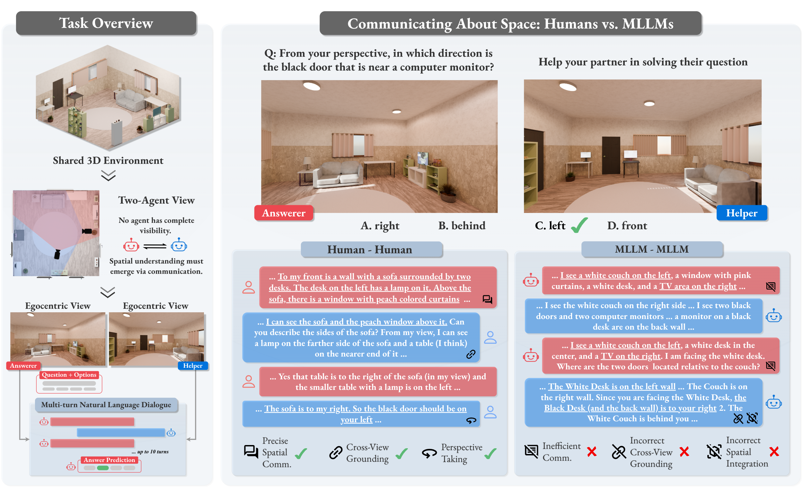

<h1 align="center">Communicating about Space:<br>Language-Mediated Spatial Integration Across Partial Views</h1>

<p align="center">
  
</p>
 
<!-- <p align="center">
  <a href="https://arxiv.org/abs/2603.27183"> </a>
  <a href="https://huggingface.co/datasets/mair-lab/Cosmic"> </a>
</p> -->

<p align="center">
  <span><a href="https://arxiv.org/abs/2603.27183"></a></span>
  <span><a href="https://huggingface.co/datasets/mair-lab/Cosmic"></a></span>
</p>
 
<p align="center">
  <strong>Ankur Sikarwar*&nbsp;&nbsp;·&nbsp;&nbsp;Debangan Mishra*&nbsp;&nbsp;·&nbsp;&nbsp;Sudarshan Nikhil&nbsp;&nbsp;·&nbsp;&nbsp;Ponnurangam Kumaraguru&nbsp;&nbsp;·&nbsp;&nbsp;Aishwarya Agrawal</strong><br>
  <em>MILA &nbsp;·&nbsp; IIIT Hyderabad</em><br>
  <sup>*Equal contribution</sup>
</p>

<div align="justify">
 
> **Can two AI agents build a shared mental map of a room just by talking to each other?**
> COSMIC is a diagnostic benchmark that tests whether Multimodal Large Language Models (MLLMs) can align distinct egocentric views through multi-turn dialogue to form a coherent, allocentric understanding of a shared 3D environment.
 
 
## Overview
 
Humans routinely transform local, viewpoint-dependent observations into shared spatial models through language. COSMIC asks whether MLLMs can do the same. The benchmark places two static agents in the same indoor scene from different egocentric viewpoints. The agents must communicate exclusively through natural language to jointly solve a spatial QA task.

<p align="center">
  
</p>
 
## Benchmark
 
### Tasks
 
COSMIC contains **899 indoor scenes** and **1,250 question–answer pairs** spanning five tasks:
 
| Task | Description |
|---|---|
| **Anchor Recognition** | Establish shared anchor objects across distinct egocentric perspectives |
| **Global Counting** | Aggregate object counts across two partial views while disambiguating which instances are shared and which are view-exclusive |
| **Relative Distance** | Estimate which object is metrically closest or farthest from a target, requiring agents to align their partial views and compare distances |
| **Relative Direction** | Determine the egocentric direction of a target object using cross-view spatial reasoning |
| **Cognitive Mapping** | Communicate complementary partial observations to build a shared map-like representation of the room, verifying whether a proposed top-down layout is spatially accurate |
 
All tasks use multiple-choice format (4 options, except Cognitive Mapping which is binary) with carefully constructed distractors.

<p align="center">
  
</p>

 
## Code

### Setup

```bash
git clone https://github.com/ankursikarwar/Cosmic.git
cd Cosmic

conda create -n cosmic python=3.10 -y
conda activate cosmic
pip install -r requirements.txt
```

Copy `.env.example` to `.env` and fill in your credentials:

```bash
cp .env.example .env
```

```ini
# HuggingFace token (required for dataset download)
HUGGINGFACE_HUB_TOKEN=your_token_here

# API keys for proprietary models
OPENAI_API_KEY=your_openai_api_key
GEMINI_API_KEY=your_gemini_api_key

# vLLM server endpoints (used by eval scripts for open-source models)
ANSWERER_API_BASE=http://localhost:4877/v1
HELPER_API_BASE=http://localhost:4877/v1

# Data directory
DATA_DIR=./data

# Evaluation results directory
EVAL_DIR=./eval_results
```

---

### Evaluation

#### 1. Download the Dataset

```bash
bash scripts/download_data.sh
```

This downloads the COSMIC benchmark from [HuggingFace (`mair-lab/Cosmic`)](https://huggingface.co/datasets/mair-lab/Cosmic) into `DATA_DIR` (default: `./data`). The dataset is organized by task:

```
data/
├── anchor_recognition/test-00000.parquet
├── global_counting/test-00000.parquet
├── relative_distance/test-00000.parquet
├── relative_direction/test-00000.parquet
└── cognitive_mapping/test-00000.parquet
```

#### 2. Launch a vLLM Server (open-source models only)

Evaluation of open-source models requires a running vLLM server. Pre-written SLURM scripts are provided under `scripts/`:

| Script | Model |
|---|---|
| `scripts/vllm_server_internvl_35_8B.sh` | InternVL3.5-8B |
| `scripts/vllm_server_internvl_35_38B.sh` | InternVL3.5-38B |
| `scripts/vllm_server_qwen_3_8B_Instruct.sh` | Qwen3-VL-8B |
| `scripts/vllm_server_qwen_3_32B_Instruct.sh` | Qwen3-VL-32B |
| `scripts/vllm_server_gemma_3_12B.sh` | Gemma3-12B |
| `scripts/vllm_server_gemma_3_27B.sh` | Gemma3-27B |

Submit with SLURM or run directly:

```bash
# SLURM
sbatch scripts/vllm_server_internvl_35_8B.sh

# Direct
vllm serve OpenGVLab/InternVL3_5-8B-Instruct \
    --port 4877 --host 0.0.0.0 \
    --tensor-parallel-size 4 \
    --gpu-memory-utilization 0.90 \
    --trust-remote-code
```

Once running, set `ANSWERER_API_BASE` and `HELPER_API_BASE` in `.env` to the server's address (e.g. `http://<hostname>:4877/v1`).

#### 3. Run Evaluation

For convenience, ready-to-use SLURM scripts are provided for all model–task combinations under `scripts/eval/`. Naming convention:

```
scripts/eval/{model}_eval_{task}.sh       # two-agent setting
scripts/eval/{model}_eval_{task}_sa.sh    # single-agent (both views) baseline
```

Examples:

```bash
# Two-agent: InternVL3.5-8B on Anchor Recognition
sbatch scripts/eval/internvl_8B_eval_anchor_recognition.sh

# Single-agent: Qwen3-32B on Global Counting
sbatch scripts/eval/qwen_32B_eval_global_counting_sa.sh

# Two-agent: Gemini 3 Flash on Cognitive Mapping
sbatch scripts/eval/gemini3_flash_eval_cognitive_mapping.sh
```

**Tasks:** `anchor_recognition` · `global_counting` · `relative_distance` · `relative_direction` · `cognitive_mapping`

**Models with scripts:** `internvl_8B` · `internvl_38B` · `qwen_8B` · `qwen_32B` · `gemma_12B` · `gemma_27B` · `gemini3_flash` · `gemini3_pro` · `gpt5_2`

To run directly with `main.py`, the following experiment variants are supported:

| `--experiment_variant` | Description |
|---|---|
| `two_agent+parallel` | Two agents each see one egocentric view and communicate to answer (**primary setting**) |
| `single_agent+both_views` | Single agent sees both views simultaneously (upper-bound baseline) |
| `single_agent+one_view` | Single agent sees only one view |
| `single_agent+no_view` | Single agent sees no image (language-only baseline) |

**Two-agent evaluation — open-source model:**

```bash
python main.py \
    --tasks_qa_file data/anchor_recognition/test-00000.parquet \
    --experiment_variant two_agent+parallel \
    --answerer_model_name OpenGVLab/InternVL3_5-8B-Instruct \
    --helper_model_name OpenGVLab/InternVL3_5-8B-Instruct \
    --answerer_client_name vllm \
    --helper_client_name vllm \
    --answerer_api_base http://localhost:4877/v1 \
    --helper_api_base http://localhost:4877/v1 \
    --max_num_turns 10 \
    --terminate
```

**Two-agent evaluation — OpenAI:**

```bash
python main.py \
    --tasks_qa_file data/anchor_recognition/test-00000.parquet \
    --experiment_variant two_agent+parallel \
    --answerer_model_name gpt-4o \
    --helper_model_name gpt-4o \
    --answerer_client_name openai \
    --helper_client_name openai \
    --answerer_api_base https://api.openai.com/v1 \
    --helper_api_base https://api.openai.com/v1 \
    --max_num_turns 10 \
    --terminate
```

**Two-agent evaluation — Gemini:**

```bash
python main.py \
    --tasks_qa_file data/anchor_recognition/test-00000.parquet \
    --experiment_variant two_agent+parallel \
    --answerer_model_name gemini-3-flash-preview \
    --helper_model_name gemini-3-flash-preview \
    --answerer_client_name gemini \
    --helper_client_name gemini \
    --answerer_api_base https://generativelanguage.googleapis.com/v1beta/openai/ \
    --helper_api_base https://generativelanguage.googleapis.com/v1beta/openai/ \
    --max_num_turns 10 \
    --terminate
```

**Single-agent evaluation (both views baseline):**

```bash
python main.py \
    --tasks_qa_file data/anchor_recognition/test-00000.parquet \
    --experiment_variant single_agent+both_views \
    --single_agent_model_name Qwen/Qwen3-VL-32B-Instruct \
    --single_agent_client_name vllm \
    --single_agent_api_base http://localhost:4877/v1
```

**Key arguments:**

| Argument | Default | Description |
|---|---|---|
| `--tasks_qa_file` | — | Path to the task parquet file |
| `--experiment_variant` | `two_agent+parallel` | Experiment mode (see table above) |
| `--max_num_turns` | `10` | Max dialogue turns per question |
| `--terminate` | `False` | Allow early termination once an answer is given |
| `--answerer_model_name` | `Qwen/Qwen3-VL-32B-Instruct` | Model for the answering agent |
| `--helper_model_name` | `Qwen/Qwen3-VL-32B-Instruct` | Model for the helper agent |
| `--answerer_client_name` | `vllm` | Client type: `vllm`, `openai`, or `gemini` |
| `--helper_client_name` | `vllm` | Client type: `vllm`, `openai`, or `gemini` |
| `--answerer_api_base` | `http://localhost:4877/v1` | API base URL for the answering agent |
| `--helper_api_base` | `http://localhost:4877/v1` | API base URL for the helper agent |
| `--temperature` | `1.0` | Sampling temperature |
| `--max_completion_tokens` | `8192` | Max tokens per model response |
| `--reasoning_effort` | `high` | Reasoning effort for GPT and Gemini models (`low`, `medium`, `high`, `minimal`, `none`) |

 
## Data Generation

For instructions on generating the COSMIC benchmark dataset, see [datagen/README.md](datagen/README.md).

 
## Citation
 
If you use COSMIC in your research, please cite:
 
```bibtex
@misc{sikarwar2026communicatingspacelanguagemediatedspatial,
      title={Communicating about Space: Language-Mediated Spatial Integration Across Partial Views}, 
      author={Ankur Sikarwar and Debangan Mishra and Sudarshan Nikhil and Ponnurangam Kumaraguru and Aishwarya Agrawal},
      year={2026},
      eprint={2603.27183},
      archivePrefix={arXiv},
      primaryClass={cs.CV},
      url={https://arxiv.org/abs/2603.27183}, 
}
```

 
## License
 
This project is released under the [MIT License](LICENSE).
 
## Acknowledgements
 
Scene generation builds on [Infinigen](https://github.com/princeton-vl/infinigen). We thank the participants of our human study for their contributions to COSMIC-HUMAN.

</div>
