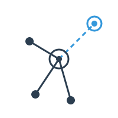
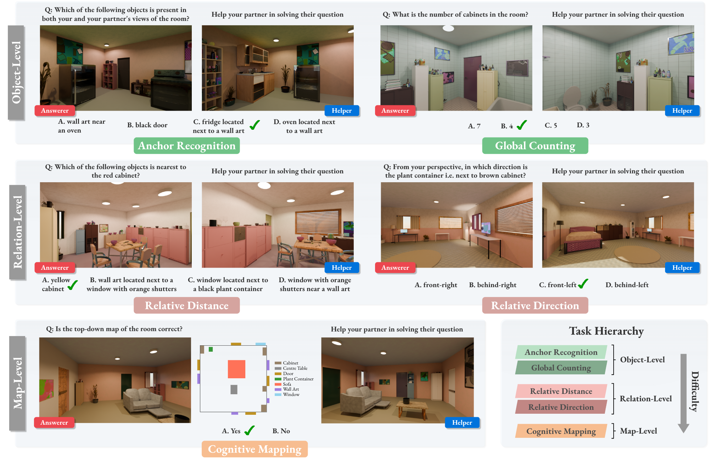

<h1 align="center">Communicating about Space:<br>Language-Mediated Spatial Integration Across Partial Views</h1>

<p align="center">
  
</p>
 
<!-- <p align="center">
  <a href="https://arxiv.org/abs/2603.27183"> </a>
  <a href="https://huggingface.co/datasets/mair-lab/Cosmic"> </a>
</p> -->

<p align="center">
  <span><a href="https://arxiv.org/abs/2603.27183"></a></span>
  <span><a href="https://huggingface.co/datasets/mair-lab/Cosmic"></a></span>
</p>
 
<p align="center">
  <strong>Ankur Sikarwar*&nbsp;&nbsp;·&nbsp;&nbsp;Debangan Mishra*&nbsp;&nbsp;·&nbsp;&nbsp;Sudarshan Nikhil&nbsp;&nbsp;·&nbsp;&nbsp;Ponnurangam Kumaraguru&nbsp;&nbsp;·&nbsp;&nbsp;Aishwarya Agrawal</strong><br>
  <em>MILA &nbsp;·&nbsp; IIIT Hyderabad</em><br>
  <sup>*Equal contribution</sup>
</p>

<div align="justify">
 
> **Can two AI agents build a shared mental map of a room just by talking to each other?**
> COSMIC is a diagnostic benchmark that tests whether Multimodal Large Language Models (MLLMs) can align distinct egocentric views through multi-turn dialogue to form a coherent, allocentric understanding of a shared 3D environment.
 
 
## Overview
 
Humans routinely transform local, viewpoint-dependent observations into shared spatial models through language. COSMIC asks whether MLLMs can do the same. The benchmark places two static agents in the same indoor scene from different egocentric viewpoints. The agents must communicate exclusively through natural language to jointly solve a spatial QA task.
 
 
## Benchmark

<p align="center">
  
</p>
 
### Tasks
 
COSMIC contains **899 indoor scenes** and **1,250 question–answer pairs** spanning five tasks:
 
| Task | Description |
|---|---|
| **Anchor Recognition** | Establish shared anchor objects across distinct egocentric perspectives |
| **Global Counting** | Aggregate object counts across two partial views while disambiguating which instances are shared and which are view-exclusive |
| **Relative Distance** | Estimate which object is metrically closest or farthest from a target, requiring agents to align their partial views and compare distances |
| **Relative Direction** | Determine the egocentric direction of a target object using cross-view spatial reasoning |
| **Cognitive Mapping** | Communicate complementary partial observations to build a shared map-like representation of the room, verifying whether a proposed top-down layout is spatially accurate |
 
All tasks use multiple-choice format (4 options, except Cognitive Mapping which is binary) with carefully constructed distractors.

 
## Code
 
> 🚧 **Code coming soon.** We are preparing the evaluation codebase for release. Star or watch this repository to be notified when it drops.

 
## Citation
 
If you use COSMIC in your research, please cite:
 
```bibtex
@misc{sikarwar2026communicatingspacelanguagemediatedspatial,
      title={Communicating about Space: Language-Mediated Spatial Integration Across Partial Views}, 
      author={Ankur Sikarwar and Debangan Mishra and Sudarshan Nikhil and Ponnurangam Kumaraguru and Aishwarya Agrawal},
      year={2026},
      eprint={2603.27183},
      archivePrefix={arXiv},
      primaryClass={cs.CV},
      url={https://arxiv.org/abs/2603.27183}, 
}
```

 
## License
 
This project is released under the [MIT License](LICENSE).
 
## Acknowledgements
 
Scene generation builds on [Infinigen](https://github.com/princeton-vl/infinigen). We thank the participants of our human study for their contributions to COSMIC-HUMAN.

</div>
